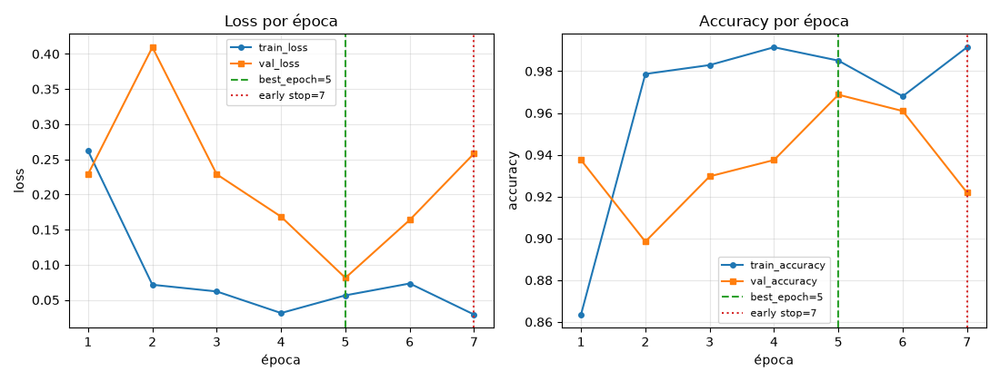

# Evidencia ML-06: early stopping y restauración del mejor checkpoint

Ejecución: 2026-10-01. Rama `feat/ml-06-early-stopping-best-checkpoint`. Servidor
MLflow de OPS-03 en `http://127.0.0.1:5050` (`docker compose up mlflow`),
manifiesto real `reports/releases/v0.1.1/manifest.json` y `data/crops` de DVC.

## Correspondencia con la evaluación

- Rúbrica 2.4: loss y accuracy de train/validation por época, curvas reales,
  época de parada, métrica vigilada con `patience` y `min_delta`, detención cuando
  corresponde, restauración de la mejor época (no la última), verificación con
  una secuencia controlada y comparación del checkpoint final con la mejor época.
- Rúbrica 3.2: artefactos de curvas y checkpoint por corrida.
- Issue #19 (ML-06): Agent Test (secuencia controlada que fuerza early stopping y
  checkpoint final = mejor época) y DoD "MLflow artifact exists".

## Reproducir

```bash
docker compose up -d --wait mlflow
cd app
uv run pytest -q tests/test_classification_early_stopping.py      # Agent Test, sin red
RUN_EARLY_STOPPING_EVIDENCE=1 MLFLOW_TRACKING_URI=http://127.0.0.1:5050 \
  .venv/bin/python -m pytest -q -s tests/test_classification_early_stopping_evidence.py
```

## 1. Agent Test: secuencia controlada de val_loss

`test_injected_metrics_force_early_stopping_and_restore_the_best_epoch` sustituye
la evaluación de validation por la secuencia `[0.9, 0.5, 0.6, 0.7, 0.3, 0.2]`
(`max_epochs=6`, `patience=2`) y guarda los pesos del modelo en cada época:

- el entrenamiento se detiene en la época 4 (`stopped_epoch=4`) y nunca ve los
  valores 0.3 y 0.2;
- `best_epoch=2` y `checkpoints/best.pt` contiene **exactamente** los pesos de la
  época 2, distintos de los de la época 4 (la última);
- `metadata` del checkpoint y métricas de MLflow registran `best_epoch=2`,
  `best_val_loss=0.5` y `stopped_epoch=4`.

Otros casos con secuencias inyectadas:

- la mejor época en medio de una corrida sin parada se restaura;
- sin parada, la mejor puede ser la última;
- `patience` y `min_delta` de `TrainingParams` cambian dónde se detiene.

## 2. Corrida real con early stopping natural

`adam`, `batch_size=32`, `max_epochs=15`, `learning_rate=0.001`, `image_size=128`,
`hidden_layers=[128]`, `dropout=0.2`, `seed=42`, `patience=2`, `min_delta=0.0`;
pesos ImageNet, 469 crops de train y 128 de validation.

```text
[info] Época 1/15: train_loss=0.2621 train_acc=0.8635 val_loss=0.2289 val_acc=0.9375
[info] Época 2/15: train_loss=0.0716 train_acc=0.9787 val_loss=0.4095 val_acc=0.8984
[info] Época 3/15: train_loss=0.0621 train_acc=0.9829 val_loss=0.2288 val_acc=0.9297
[info] Época 4/15: train_loss=0.0314 train_acc=0.9915 val_loss=0.1685 val_acc=0.9375
[info] Época 5/15: train_loss=0.0565 train_acc=0.9851 val_loss=0.0814 val_acc=0.9688
[info] Época 6/15: train_loss=0.0734 train_acc=0.9680 val_loss=0.1638 val_acc=0.9609
[info] Época 7/15: train_loss=0.0292 train_acc=0.9915 val_loss=0.2584 val_acc=0.9219
[info] Early stopping en la época 7: 2 épocas sin mejorar val_loss (min_delta=0.0); mejor época 5
[info] Run a3809ac13fa7406cb5b18ee47c266ad4 FINISHED; checkpoint de la época 5 en checkpoints/best.pt
duración 51s | best_epoch=5 stopped_epoch=7 épocas=7 | runs:/a3809ac13fa7406cb5b18ee47c266ad4/checkpoints/best.pt
```

## 3. El checkpoint final es la mejor época (proceso nuevo, API de MLflow)

Se descarga `checkpoints/best.pt` del servidor y se vuelve a evaluar en
validation con el mismo preprocesamiento:

```text
run a3809ac13fa7406cb5b18ee47c266ad4: FINISHED | early_stopped=True
métricas resumen: {'best_epoch': 5.0, 'best_val_loss': 0.08136008866131306, 'stopped_epoch': 7.0, 'epochs_completed': 7.0}
params: {'early_stopping_monitor': 'val_loss', 'early_stopping_mode': 'min', 'patience': '2', 'min_delta': '0.0', 'max_epochs': '15'}
val_loss por época (MLflow): {1: 0.2289, 2: 0.4095, 3: 0.2288, 4: 0.1685, 5: 0.0814, 6: 0.1638, 7: 0.2584}
artefactos: ['checkpoints/best.pt', 'curves/history.json', 'curves/training_curves.png']
metadata de best.pt: {'best_epoch': 5, 'best_val_loss': 0.08136008866131306, 'stopped_epoch': 7, 'epochs_completed': 7}
best.pt re-evaluado en validation: val_loss=0.081360 val_acc=0.9688
  época 5 en MLflow: 0.081360 | coincide=True
  época 7 (última):  0.258398 | coincide=False
```

`best.pt` reproduce el `val_loss` de la época 5 (0.081360) y no el de la época 7,
la última que se entrenó (0.258398). La corrida de evidencia
(`test_classification_early_stopping_evidence.py`) repitió los mismos valores.

## 4. Curvas (artefacto `curves/training_curves.png` de esa corrida)



La línea verde marca `best_epoch=5` (pesos restaurados) y la roja el early
stopping en la época 7. `curves/history.json` contiene los mismos valores que las
métricas por época de MLflow (`test_curves_are_logged_from_the_real_epoch_metrics`).

> La `val_accuracy` de validation (0.9688 en la época 5) no es la métrica final de
> test: esa evaluación es de otro issue.
