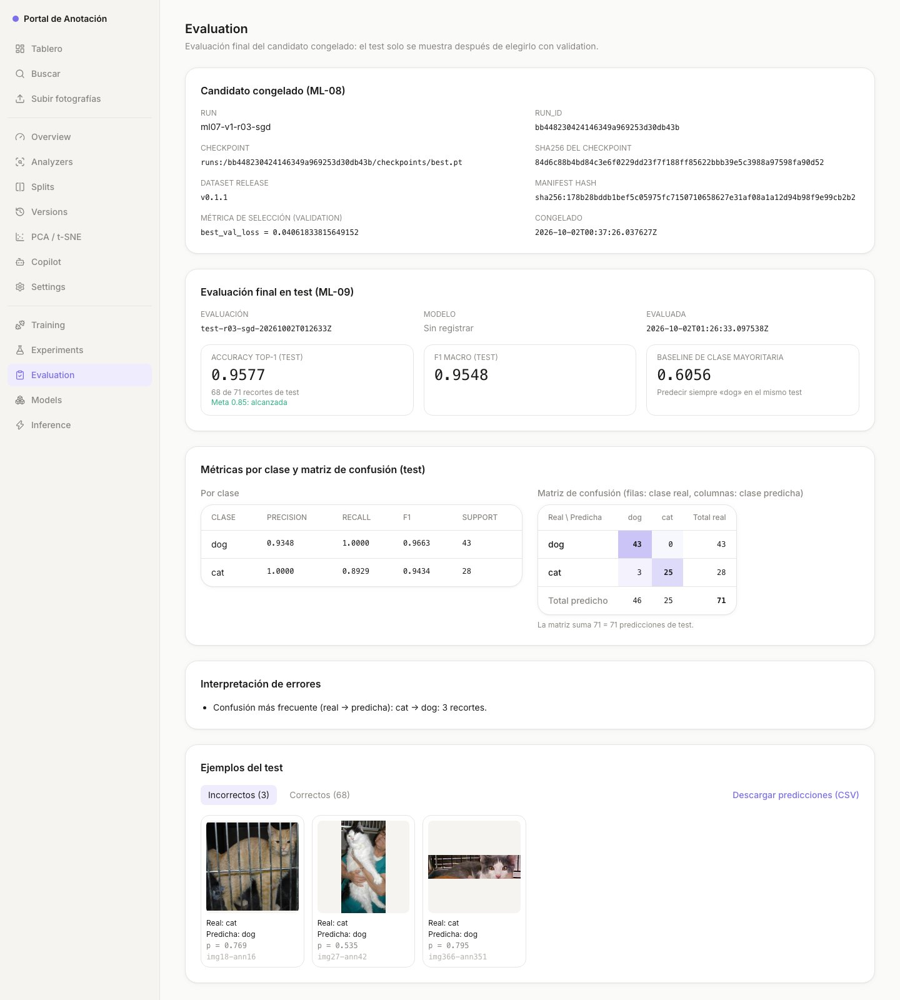
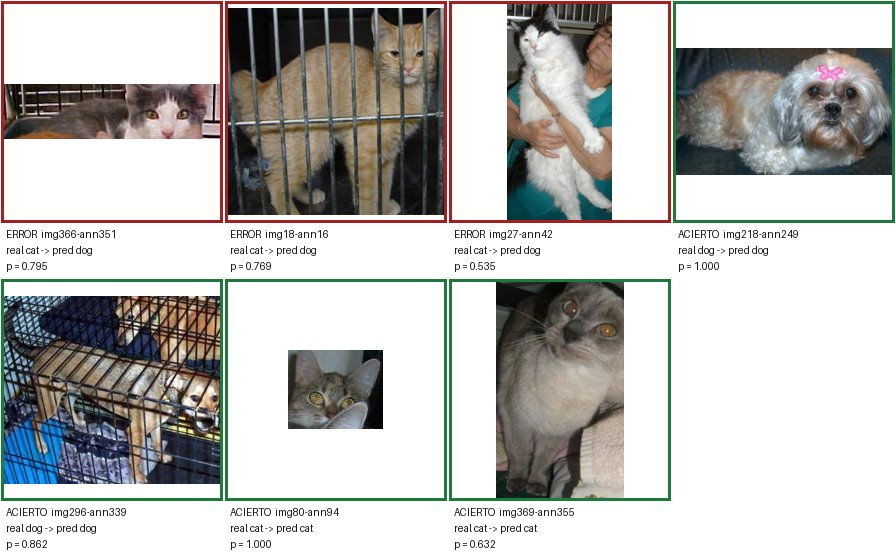

# Evidencia ML-10: auditoría final de calidad y análisis de errores

Ejecución: 2026-10-02, rama `feat/ml-10-final-quality-audit`. Audita la evaluación
final de ML-09 `test-r03-sgd-20261002T012633Z` del candidato congelado `r03-sgd`
(`bb448230424146349a969253d30db43b`), release `v0.1.1`, split `test` (71 crops).

```bash
docker compose up -d --wait mlflow ml-api backend frontend   # con GIT_COMMIT definido
cd app && uv run python -m classification.quality_audit
```

La auditoría escribe:
- [`reports/quality/ml10_quality_audit.json`](../../../reports/quality/ml10_quality_audit.json):
  todas las cifras recalculadas y cada comparación;
- [`reports/quality/ml10_portal_evaluation.html`](../../../reports/quality/ml10_portal_evaluation.html):
  el DOM de la pantalla Evaluation tal como se comparó;
- [`ml-10-examples.jpg`](ml-10-examples.jpg): los ejemplos reales del test.

No escribe en MLflow ni toca la evaluación de ML-09.

## Correspondencia con la evaluación

- **Rúbrica 4.3:** `aciertos / total de crops de test`, comparado con 0.85 con enteros
  y sin redondear. Los IDs son exactamente los del test congelado y las dos clases
  declaradas están cubiertas.
- **Rúbrica 4.4:** ejemplos reales de errores y aciertos, con su recorte, clase real,
  predicha y probabilidad. Clase más confundida, baseline de clase mayoritaria sobre
  el mismo test y análisis de si el 85% oculta un recall bajo.
- **Rúbrica 4.2 (regla 4 del evaluador):** la matriz y las métricas se recalculan
  desde las predicciones y se comparan con MLflow, la API y el portal.
- **Issue #53 (ML-10), Agent Test:** todo se recalcula **solo** desde
  `test-r03-sgd-20261002T012633Z.predictions.csv` (sha256 `b52c2a83…0081`). El
  código de [`quality_audit.py`](../../classification/quality_audit.py) no reutiliza
  `compute_metrics` de ML-09, y un test lo comprueba.

## 1. Métricas recalculadas desde el archivo de predicciones

Antes de calcular, se valida el CSV, y una sola fila inconsistente rechaza el
archivo completo. Las reglas:
- `crop_id` único e igual a `img<image_id>-ann<annotation_id>`;
- clases conocidas;
- probabilidades en [0, 1] que suman 1;
- clase predicha igual al argmax;
- columna `correct` coherente con la clase real y la predicha.

| Métrica | Valor recalculado |
|---|---|
| Matriz (filas real, columnas predicha `[dog, cat]`) | `[[43, 0], [3, 25]]`, suma 71 |
| Accuracy top-1 | 68/71 = **0.9577464788732394** |
| ¿≥ 0.85? (enteros: 68·20 = 1360 ≥ 17·71 = 1207) | **Sí** |
| F1 macro | 0.9548441806232775 |
| dog: precision / recall / F1 / support | 0.9347826086956522 / 1.0 / 0.9662921348314606 / 43 |
| cat: precision / recall / F1 / support | 1.0 / 0.8928571428571429 / 0.9433962264150945 / 28 |
| Baseline de clase mayoritaria (siempre `dog`) | 43/71 = 0.6056338028169014 |
| Accuracy sobre el baseline | +0.3521 (35.2 puntos) |

## 2. Comparación con MLflow, API y portal

| Fuente | Qué se compara | Resultado |
|---|---|---|
| MLflow (run `bb44823…`) | métricas `test_*` (accuracy, F1 macro, correct, total, precision/recall/F1/support por clase), tag `test_accuracy_meets_target` y matriz del artefacto `evaluation/test/<id>.json` | **17/17 iguales** |
| API (`GET /api/ml/evaluation`, vía nginx) | accuracy, F1 macro, aciertos, total, métricas por clase y matriz; además, las 71 predicciones muestra por muestra (`image_id`, clase real, predicha, probabilidades) | **16/16 iguales**, 0 diferencias por muestra |
| Portal (`/ml/evaluation` renderizado en Chrome headless) | cada cifra visible: accuracy, "68 de 71", "Meta 0.85: alcanzada", F1 macro, baseline y su clase, tabla por clase, matriz con totales, confusión más frecuente, recall bajo, conteos de las pestañas, crops de error y su `p = …` | **32/32 iguales** |
| Portal, a precisión completa (vitest) | `summarizeEvaluation` (el cálculo del portal) con la evaluación real contra este reporte, sin redondear | **5/5 tests pasan** |
| Recortes de los ejemplos (`GET /api/ml/crops/<id>`) | la API sirve un PNG con el mismo sha256 que `data/crops` | **7/7 idénticos** |

El portal muestra 4 decimales. La comparación aplica el mismo redondeo que
`toFixed` de JavaScript (valor binario exacto, empate hacia arriba), así que una
cifra distinta en el cuarto decimal también se detecta. Las 32 cifras están en
`reports/quality/ml10_quality_audit.json` (`comparisons`).



**Discrepancias encontradas: ninguna.** Si alguna fuente se desvía, los tests de
regresión fallan:
- **Python:** `test_a_different_mlflow_metric_is_detected`,
  `test_api_predictions_are_compared_sample_by_sample`,
  `test_a_different_figure_on_the_portal_is_detected`,
  `test_a_discrepancy_in_any_source_fails_the_audit` y
  `test_a_crop_served_with_other_content_is_detected`.
- **vitest:** `frontend/tests/ml-quality-audit.test.ts` falla si cambia el cálculo
  del portal. Lo comprobé redondeando la accuracy, comparando la meta en float y
  cambiando el baseline: las 3 variantes fallan.

## 3. Análisis de errores



**Errores (todos los del test, del más al menos confiado):**

| crop | real | predicha | p(dog) | p(cat) |
|---|---|---|---|---|
| `img366-ann351` | cat | dog | 0.7945 | 0.2055 |
| `img18-ann16` | cat | dog | 0.7691 | 0.2309 |
| `img27-ann42` | cat | dog | 0.5348 | 0.4652 |

**Aciertos (por clase, el más y el menos confiado):** `img218-ann249` dog (p = 1.000),
`img296-ann339` dog (0.862), `img80-ann94` cat (1.000) e `img369-ann355` cat (0.632).

Los 7 recortes pertenecen al split `test` del manifiesto congelado, y en las 71
predicciones la clase real coincide con la del manifiesto.

- **Clase más confundida: `cat`.** Concentra los 3 errores; la única confusión es
  `cat → dog` (3 recortes) y ningún perro se predijo como gato. Por eso la
  precision de `dog` (0.9348) es la que baja y el recall de `dog` es 1.0.
- **¿El 85% oculta un recall bajo?** No por debajo de la meta: el recall más bajo
  es el de `cat`, 25/28 = 0.8929 ≥ 0.85, comparado con enteros. Pero `cat` es la clase débil: el error se
  concentra en ella, y con 28 gatos el intervalo de Wilson al 95% de su recall es
  [0.728, 0.963]. No se puede afirmar que su recall real supere 0.85. El de la
  accuracy global (68/71) es [0.883, 0.986], por encima de 0.85.
- **Observación sobre los errores (no es una causa demostrada):** dos de los tres
  gatos fallados están detrás de rejas de jaula (`img18-ann16`, `img366-ann351`),
  y el tercero, el de menor confianza (0.535), es un gato blanco de pelo largo
  sostenido por una persona. Entre los aciertos de `dog` también hay un perro en
  jaula (`img296-ann339`, p = 0.862). Es consistente con que el fondo de jaula
  empuje hacia `dog`, pero con 3 errores no se puede concluir.

## 4. El test sigue congelado y el candidato no cambió

`frozen_problems` revisa la evaluación contra el candidato y los tags de todos
los runs de MLflow marcados `candidate=true`. No encontró problemas:

- la evaluación tiene el mismo run, checkpoint, release y `manifest_hash` que el
  candidato;
- se hizo después de congelar el candidato: `created_at 2026-10-02T01:26:33Z` >
  `frozen_at 2026-10-02T00:37:26Z`;
- en MLflow, el run tiene `candidate=true` con el mismo `candidate_frozen_at`, no
  tiene `candidate_replaced_by` y ningún otro run está marcado como candidato;
- `test_evaluation_id` del run es esta evaluación.

La auditoría es de solo lectura (`test_the_audit_writes_nothing_and_leaves_the_candidate_unchanged`):
no cambia el candidato, los archivos de evaluación ni el run en MLflow. Tampoco
se reentrenó, se cambió de candidato ni se ajustó nada después de ver el test.

## 5. Conclusión

El modelo `r03-sgd` **alcanza la meta**: 68/71 = 0.9577 ≥ 0.85 en el test
congelado, 35 puntos sobre el baseline de clase mayoritaria (0.6056). Todas las
cifras coinciden, sin discrepancias, entre el CSV de predicciones, MLflow, la API
y el portal. La limitación es la clase `cat`: recall 0.893 con 28 ejemplos, y los
3 errores son gatos predichos como perro.

## 6. Pruebas

- `uv run pytest tests/test_classification_quality_audit.py`: 56 tests. Cubren
  métricas con predicciones conocidas, CSV inconsistente, la meta con enteros
  (incluido el caso límite donde el float daría 0.85), baseline con empates,
  confusiones, recall oculto, ejemplos, split congelado, candidato cambiado, y
  comparación y discrepancias con MLflow, la API y el portal.
- `npx vitest run tests/ml-quality-audit.test.ts` (en `frontend/`): el cálculo del
  portal contra este reporte.
- **Mutaciones** (worktree aislado, sin caché de bytecode): rompí 28 reglas a propósito, entre ellas:
  - matriz traspuesta, precision calculada con el support y F1 macro ponderado;
  - meta comparada en float o redondeada;
  - baseline con columnas predichas o sin empates; clase más confundida por
    número de errores; recall bajo con `<=`;
  - quitar cada validación del CSV, del split o del candidato congelado;
  - comparar con tolerancia o dar una cifra ausente como igual;
  - no comparar las muestras ni las probabilidades de la API;
  - redondear como Python en vez de `toFixed`;
  - no leer la matriz de MLflow, no verificar el sha256 de los recortes o no
    ordenar los errores.

  Al principio sobrevivían 5, porque los datos de prueba no las distinguían: la
  matriz era simétrica, ningún valor caía en un empate de redondeo y el CSV ya
  venía ordenado. Agregué un test para cada una y ahora mueren las 28.
- **Mutaciones del portal** (vitest): redondear la accuracy, comparar la meta en
  float y cambiar el baseline. Mueren las 3.
